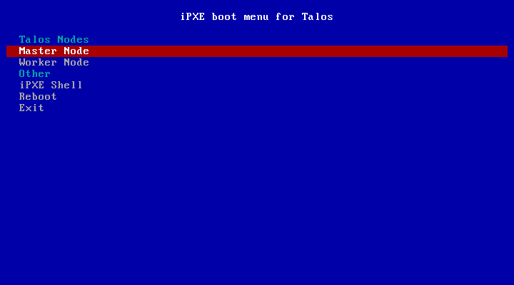

# talos-pxe

Talos PXE is a project aimed at boostrapping an initial Talos cluster from a single bootable USB stick. This stick plugs into an avaiable computer and will provide a selection menu for any PXE bootable machine connected to the same network. The software is able to adapt to an existing DHCP server via proxyDHCP or provide a DHCP server of its own.



## Requirements

- Docker
- Golang version 1.16.7
- LinuxKit

## Building

You need to download the Talos kernel and initramfs before proceeding. Files can be found on [talos release page](https://github.com/talos-systems/talos/releases) These should be placed in `assets`:

```
assets/initramfs-amd64.xz
assets/vmlinuz-amd64
```

Generate the configuration via:

```
talosctl gen config -o assets talos-k8s-metal-tutorial https://controlplane.talos:8443
sed 's/type: controlplane/type: init/' assets/controlplane.yaml > assets/init.yaml
```

First step is building the pxe network container via:

```
docker build -t talos-pxe --target talos-pxe .
```

then that container can be converted into a bootable VM via LinuxKit:

```
linuxkit build -docker -format iso-bios linux.yml

(if you get a VFS error booting this image, you may need to try other formats like `raw-bios` or `raw-efi`)
```

## Unittests

Unittests are run in a docker container, that is build before the tests, so they can be run on Linux or Mac. (I have not tried 
Windows). Coverage files can be found after run in out/coverage.html 

```bash
make unittest
```

One test can be run with following make target:

```bash
make unittest-one TEST_PATTERN=<test name>
```

## Local verification setup

Disclaimer: This setup will probably not work for you, but it can remind me in a few months how to set this thing up.
Used virtualization `libvirt + KVM`

### Prepare binary and served files

1. Follow steps from build section, about assets and talos configs 
2. Set required capabilities on the talos-pxe binary
    ```bash
    sudo setcap cap_net_raw,cap_net_admin,cap_net_bind_service+eip ./talos-pxe
    ```

### Setup for verifying DHCP no proxy mode

1. Stop DHCP service on the virbr0 interface
    - find ip range used on that interface, it is 192.168.122.1/24 in my case
    ```bash
    sudo netstat -lutnp
    
    Active Internet connections (only servers)
    Proto Recv-Q Send-Q Local Address           Foreign Address         State       PID/Program name    
    tcp        0      0 192.168.122.1:53        0.0.0.0:*               LISTEN      1216/dnsmasq         
    ...
    udp        0      0 192.168.122.1:53        0.0.0.0:*                           1216/dnsmasq        
    ... 
    udp        0      0 0.0.0.0:67              0.0.0.0:*                           1216/dnsmasq

    sudo kill -9 <pid for dnsmasq>
    ```
2. You might need to allow ports needed by talos-pxe to be open, I did not have to on Ubuntu 20.04
3. Run talos-pxe
   ```bash /talos-pxe --if virbr0 --addr 192.168.122.1/24```
4. In virt-manager create a new vm with PXE boot and watch it working

### Setup for verifying DHCP proxy mode
1. If you were runing the no proxy mode first then get the dnsmasq back up
2. We need to set up an interface that is controlled by talos-pxe and connected to the virbr0 interface tha other DHCP server is controlling, (dnsmasq in my case)
to get there we are doing some magic with a veth pair: 
    ```bash
    sudo ip link add eth0 type veth peer name eth1
    sudo ip link set dev eth1 master virbr0
    sudo ip link set eth1 up
    ```
3. Again you might need to set some firewall rules for the ports used by talos-pxe, I did not have to. 
4. Run talos pxe with that interface
```bash ./talos-pxe --if eth1 ```

 
